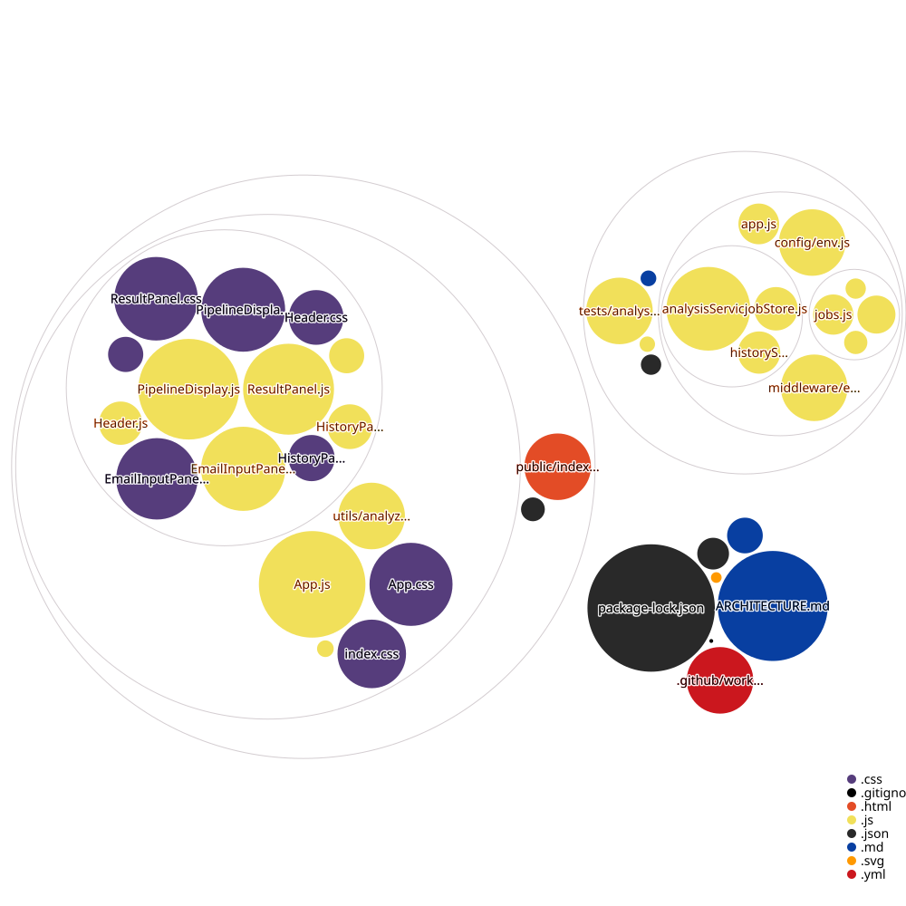

# SpamShield AI

AI-powered spam email analysis platform with a separated frontend and backend architecture.

## Repository Diagram



This diagram is automatically refreshed by GitHub Actions whenever the repository changes on the main branch.

## Setup

### Frontend

```bash
npm run dev
```

Open http://localhost:3000

### Backend

```bash
npm run server
```

API base URL: http://localhost:5000

## Project Structure

```
frontend/
├── public/
├── src/
│   ├── components/
│   ├── utils/
│   └── App.js
│
backend/
├── src/
│   ├── routes/
│   ├── services/
│   ├── middleware/
│   └── config/
├── data/
└── tests/
```

## Auto-updating Diagram Workflow

The repository includes a GitHub Actions workflow at .github/workflows/create-diagram.yml.

It will:
- generate a fresh diagram.svg
- commit the updated diagram back to the repository
- keep the README visualization current automatically

## Tech Stack

- React 18 frontend
- Express backend
- Recharts for visual reporting
- SSE-style job streaming and persisted analysis history
